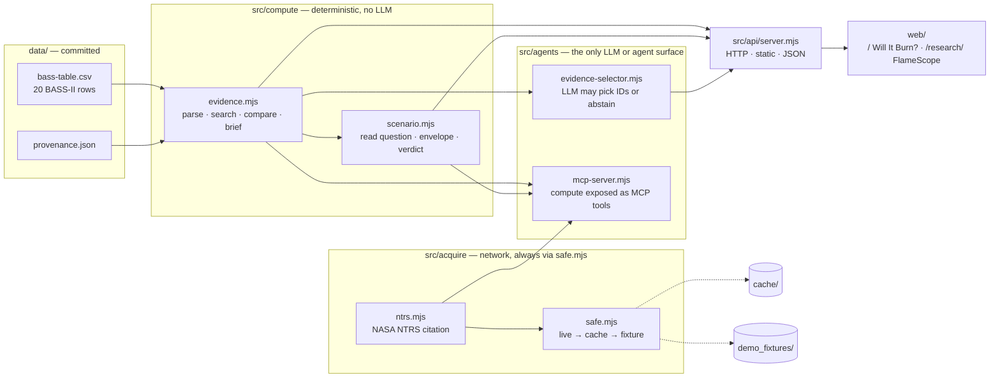

# Architecture

One Node.js process with zero dependencies. The rule that shapes everything else: **science is computed, never generated.**

## Layers and their contracts

| Layer | May | May not | Enforced by |
|---|---|---|---|
| `src/acquire/` | Make network calls, but only through `fetchJson` in `safe.mjs`, and write `cache/` | Compute science, or call an LLM | Code review, [CLAUDE.md](../../CLAUDE.md) |
| `data/` | Hold hand-transcribed, source-cited rows | Hold derived or generated numbers | `provenance.json`, [data-model.md](data-model.md) |
| `src/compute/` | Pure functions of `data/` plus the request | Use `fetch`, `process.env`, `Math.random`, or import from `agents/` or `acquire/` | `test/boundary.test.mjs` |
| `src/agents/` | Call an LLM, and expose tools to agents | Write claims or numbers. It can only choose among compute outputs. | Enum-bound schema plus `validateSelection` |
| `src/api/` | Route, validate input, serve `web/` | Hold science logic | Review |
| `web/` | Render JSON, escape everything, run offline | Compute a claim, or load remote assets | CSP `default-src 'self'` |

`makeBrief` stamps `createdAt` with the wall clock. That's metadata, not science, and it is the one allowed non-determinism in compute.

## Request flow: "Will it burn on a Moon base at 34% oxygen?"

1. `web/app.js` → `GET /api/ask?q=…`
2. `server.mjs` → `ask()` in `scenario.mjs`
3. `parseQuestion` gives `{mission: moon, o2: 34}`. `resolveScenario` then merges taps, the question and defaults.
4. `checksFor` compares the cabin with `ENVELOPE` (derived from the 20 rows). Gravity and O₂ fail.
5. The answer is built: verdict `no-data`, gap cards (each with a source) and `nearest` params.
6. The browser draws the stamp, the checks table, the gap cards and the dashed flame (labelled "illustration").

## Offline design

- No remote fonts, scripts or tiles. Chart and flame are drawn locally with SVG and canvas.
- The core data is committed, so it never needs fetching.
- Any live enrichment (NTRS metadata, and later FIRMS) goes through `safe.mjs` and returns a `source` label.
- `OFFLINE=1` disables the network and the AI step. The UI says which mode is active.
- See [offline-demo.md](offline-demo.md).

## Why not the template's FastAPI stack?

The brief's repository layout suggests FastAPI. We kept the working, tested Node implementation and mapped its folders onto the template instead. See [decisions.md](decisions.md) ADR-001.

## Deployment

The server binds to `127.0.0.1` only. For judges, the plan is a static export of `web/` plus pre-computed JSON (see [roadmap](roadmap.md) R4), or a recorded demo. There is no public API server without auth and quotas.
