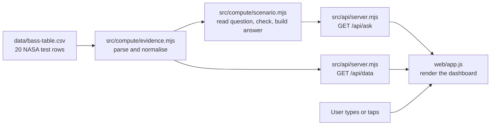

# Will It Burn? — how it works

This file explains how a question becomes an answer. It covers where the data comes from, how the search reads a question, how the answer is built, and how the browser turns the answer into the dashboard. For the idea and the user journey, read [will-it-burn-concept.md](will-it-burn-concept.md).

## Run it

Node.js 22 or newer. No install step and no packages.

```powershell
node src/api/server.mjs
```

The server prints two addresses:

```text
Will It Burn?: http://127.0.0.1:3000/
FlameScope:    http://127.0.0.1:3000/research/
```

Run the tests with `node --test`.

## The big picture



The server decides every scientific statement. The browser only draws what the server sends back. That keeps the logic in one place, where tests can check it.

| File | Job |
|---|---|
| `data/bass-table.csv` | The 20 BASS-II rows, transcribed from NASA/TM-20210011385, Table 5.1, printed p. 57 |
| `data/provenance.json` | Where the rows came from, how they were transcribed, and their known limits |
| `src/compute/evidence.mjs` | Loads the CSV into clean records. It is shared with FlameScope. |
| `src/compute/scenario.mjs` | Reads the question, merges it with taps, checks it against the evidence, and builds the answer |
| `src/compute/findings.mjs` | Ranks what the 20 rows show by how consistently matched comparisons agree |
| `data/fire-response.json`, `src/compute/response.mjs` | NASA's ISS fire-response steps, quoted in NASA's order, with the evidence for each step |
| `src/acquire/psi.mjs` | Fetches NASA's PSI-25 experimental table through `safe.mjs`, to cross-check our O₂ values |
| `src/api/server.mjs` | The local HTTP server: static files plus the JSON routes |
| `web/index.html`, `style.css`, `app.js` | The Will It Burn? page |
| `test/scenario.test.mjs` | Tests for the question reader, the answer rules and the routes |

## 1. Where the data comes from

The data is **not fetched from the internet at runtime**. The team transcribed the rows by hand from the NASA report into a CSV that ships with the project. That makes the app work offline and keeps every number traceable to one printed page.

`data/bass-table.csv` has one row per test:

| Column | Meaning | Unit |
|---|---|---|
| `test_id` | NASA's test name, M1 to M20 | none |
| `thickness_mm` | Acrylic sheet thickness | mm |
| `width_cm` | Sheet width | cm |
| `burning_sides` | 1 or 2 sides burning | count |
| `velocity_cm_s` | Airflow readings, separated by `;` | cm/s |
| `spread_mm_s` | Flame spread at each airflow, same order. Blank means not tracked. | mm/s |
| `burn_min` | How long the test burned | minutes |
| `initial_o2_vol_pct`, `final_o2_vol_pct` | Oxygen at the start and end of the test | % by volume |

A synthetic example row, not real data, looks like this:

```text
MX,2,2.2,2,10;6,0.050;0.041,20.0,21.0,19.5
```

That reads as a 2 mm sheet, 22 mm wide, burning on two sides. It spread at 0.050 mm/s at 10 cm/s airflow and 0.041 mm/s at 6 cm/s. It burned for 20 minutes while oxygen fell from 21.0% to 19.5%.

## 2. Loading and cleaning: `src/compute/evidence.mjs`

When the server starts, `evidence.mjs` reads the CSV once and turns each line into a record:

- **Arrays stay paired.** `10;6` and `0.050;0.041` become `velocity: [10, 6]` and `spread: [0.050, 0.041]`. Position 0 of one goes with position 0 of the other.
- **Units are normalised.** Width in cm becomes `widthMm`. Airflow stays cm/s and spread stays mm/s.
- **Missing stays missing.** A blank spread becomes `null`, never zero. M6 and M12 are like this.
- **Fixed facts are attached.** Every record gets its material (PMMA), geometry (sheet), flow direction (opposed) and exact source location.

Both FlameScope and Will It Burn? use these same records.

## 3. The evidence envelope

`src/compute/scenario.mjs` computes what the 20 rows cover. It derives this from the records, never from typed-in numbers, so it updates by itself if rows are added.

| Condition | Covered by the tests | How it's worked out |
|---|---|---|
| Material | Acrylic (PMMA) | Every row is PMMA |
| Gravity | Microgravity on the ISS | BASS-II ran in orbit |
| Oxygen | 16.8% to 22.2% | Lowest and highest of all start and end values |
| Oxygen partial pressure | 17 to 22.5 kPa | The oxygen range multiplied by station pressure |
| Pressure | About 14.7 psi | Not in the table. BASS-II ran in the station glovebox at about 1 atm, and this is stated on screen. |
| Airflow | 2 to 21 cm/s | Lowest and highest airflow reading |
| Thickness | 1, 2, 3, 4 and 5 mm | The distinct thickness values |

## 4. How the search works: `parseQuestion()`

The search box is **not an AI model**. It is a small, rule-based reader. It is predictable, it runs offline, and every rule is covered by tests. It never answers the question. It only turns the words into structured fields.

Step by step:

1. **Normalise.** Lower-case the text, turn `O₂` into `o2`, and collapse spaces.
2. **Find the place.** Each mission has a word pattern. If several match, the one mentioned first wins, and a notice says so. "Mars transit" or "on the way to Mars" beats plain "Mars."
3. **Find the cabin air.** Words like "exploration" or "low pressure" select the Exploration preset. Words like "Earth-normal" or "sea level" select Earth-normal.
4. **Find numbers with units.**
   - Pressure in psi, kPa or atm is converted to psi.
   - Oxygen is read from `34% oxygen`, `O2 at 30%`, or a bare `34%`.
   - Airflow is read from `12 cm/s`. "Still air", "no ventilation" and "fans off" mean 0 cm/s.
5. **Find the thickness.** One `N mm` sets that thickness. Two or more mean you are comparing, so every thickness is shown. "Thin" and "thick" map to the thinnest and thickest tested sheet, with a notice.
6. **Find the material.** It checks a list of known materials. If acrylic is mentioned, it wins and a notice says the others aren't in the data. Otherwise the first untested material is used, such as Nomex.
7. **Watch for safety words.** "Safe", "certify" and "recommend" add a notice that the tool can't certify materials.
8. **Say when nothing was found.** If no field matched, a notice says the defaults are shown.

Examples, taken from the tests:

| Question | Fields found |
|---|---|
| Will acrylic burn on the ISS? | mission `iss`, material `pmma` |
| Will it burn on a Moon base at 34% oxygen? | mission `moon`, oxygen `34` |
| What about Mars transit in exploration air? | mission `transit`, air `exploration` |
| Does a 1 mm sheet burn faster than 5 mm? | thickness `all`, with a "comparing" notice |
| Will a 1 mm acrylic sheet burn in still air? | thickness `1`, airflow `0`, material `pmma` |
| Is Nomex safe on a Mars base? | mission `mars`, material `nomex`, with a safety notice |
| plexiglass at 56.5 kPa | material `pmma`, pressure `8.2` psi |

### Why not use an AI model for this?

A fire-safety tool must not guess. Rules are easy to test and never invent a field. If the team wants AI later, the safe way is the same pattern FlameScope already uses: the model may only fill the same fields, validated against this schema, and the app falls back to the rules if the model fails. The model would never write the answer.

## 5. Merging the question with taps: `resolveScenario()`

Each field is filled in this order:

1. **A tap**, meaning an explicit URL parameter such as `mission=moon`.
2. **The question**, meaning what `parseQuestion()` found.
3. **A default:**
   - Mission defaults to ISS.
   - Air defaults to that mission's usual air.
   - Material defaults to acrylic.
   - Thickness defaults to all sheets.
   - Airflow defaults to any tested airflow.

The server records where each field came from: `picked`, `question` or `default`. The page shows that as the chip colours in the **Read as** row.

Cabin air works like this:

- Start from a preset: Earth-normal is 14.7 psi at 21%, and Exploration is 8.2 psi at 34%.
- Apply any oxygen or pressure number on top of the preset.
- If the result matches a preset exactly, it takes that preset's name. Otherwise it is called "Custom."
- The server always calculates oxygen partial pressure in kPa as well.

Bad input is refused rather than guessed. Examples are an unknown mission, a non-number thickness, or a question longer than 500 characters. The server returns HTTP 400 with a plain message.

## 6. Checking the cabin against the evidence

`checksFor()` builds one row per condition:

| Check | Passes when | Always shown? |
|---|---|---|
| Material | The material is acrylic | Yes |
| Gravity | The mission is in microgravity | Yes |
| Oxygen | The oxygen share is within 16.8% to 22.2% | Yes |
| Pressure | The pressure is within 0.5 psi of 14.7 | Yes |
| Airflow | The airflow is within 2 to 21 cm/s | Only if you gave an airflow |
| Thickness | The thickness is one of the tested values | Only if you gave a thickness |

If **every** check passes, the evidence covers your cabin. If any check fails, the answer is "No data."

## 7. Building the answer: `ask()`

`ask()` is the single function behind `GET /api/ask`. It returns everything the page needs.

**When every check passes:**

- **Verdict:** a "Burned" stamp plus the burn-time range for the matching rows.
- **Evidence:**
  - The matching test IDs.
  - A count of tests and of tests with spread not tracked.
  - The shortest and longest burn.
  - The fastest and slowest spread, each with its test ID, thickness and airflow.
- **Finding:** with all thicknesses, it compares the fastest 1 mm sheet with the fastest 5 mm sheet. With one thickness, it gives that thickness's spread range and airflow range.
- **Why it matters:** a sourced line from the related BASS-II rod study.
- **Ranked findings:** five descriptive findings over all 20 tests, from `findings.mjs`. See below.

### Ranked findings: `findings.mjs`

The challenge asks the dashboard to rank findings. `rankFindings()` does this with fixed, checkable rules. It computes the result once, when the server starts:

1. **Comparisons.** For each factor (airflow, thickness, width, oxygen, burning sides), pair every two measured spreads that match on all the other listed conditions. Airflow pairs come from inside one test, where the sample stays the same. The others pair different tests at the same airflow. Untracked spreads (M6, M12) never enter a pair.
2. **Agreement.** A pair agrees when the side the lead expects to be faster really spread faster. For example, the thinner sheet in a thickness pair.
3. **Tier.** Consistent: 10 or more comparisons, with at least 85% agreeing. Suggestive: 4 or more, with at least 75%. Mixed: 4 or more, under 75%. Too few tests: under 4. Only Consistent and Suggestive findings get a claim as their lead. The others show just the topic.
4. **Order.** Sort by tier, then by the share that agrees, then by the number of comparisons.
5. **Caveats from the rows.** Oxygen fell during every test, and the table gives only start and end oxygen, so airflow can't be separated from it. The one airflow exception, M3, is also the only test listed from low to high flow. All 3 thickness exceptions had more starting oxygen on the thicker sheet.

Today's result: airflow 29 of 30 (Consistent), thickness 23 of 26 (Consistent), width 3 of 4 (Suggestive), oxygen 2 of 2 (Too few tests), burning sides 0 of 1 (Too few tests). Every pair is returned in `pairs`, so each count can be checked row by row.

**When a check fails:**

- **Headline:** built from the first failing check, in this order: material, gravity, oxygen, pressure, airflow, thickness.
- **Gap cards:** each failing check adds one or two cards, and every card carries its source link.
  - **Gravity:** two cards. One cites LUCI, the first lunar-gravity burns longer than 25 seconds (NTRS 20250010653). The other cites the Fire Safety Journal rod study, which puts lunar gravity near the worst case for acrylic rods.
  - **Oxygen and pressure:** one card compares oxygen partial pressure with the tested range. When that pressure is inside the range, it adds that the cabin has less than half the nitrogen. Saffire V and VI are named as where the data lives: about 10 psi and 26% O₂, and about 8 psi and 29–31% O₂ (ICES-2024-365, Table 1). SoFIE is named too.
  - **Airflow:** still air, or flows above the tested range.
  - **Thickness:** the tested sheet sizes.
- **Nearest evidence:** a set of parameters that fixes every failing check. It switches to acrylic, the ISS, Earth-normal air, any tested airflow, or the nearest tested thickness. The tests confirm this always lands on a "Burned" answer.

**In both cases the response also includes:**

- **A canonical question**, such as "Will a 1 mm acrylic sheet burn on the ISS in Earth-normal air?". The page writes it into the search box after a tap, so the box always matches the screen.
- **The Read-as chips and notices.**
- **One badge per mission tile**, counting how many tests match that mission with its own default air.

## 8. The API

### `GET /api/ask`

Every parameter is optional.

| Parameter | Values | Meaning |
|---|---|---|
| `q` | Up to 500 characters | The typed question |
| `mission` | `iss`, `moon`, `transit`, `mars` | A tapped mission |
| `air` | `earth`, `exploration` | A tapped cabin-air preset |
| `o2` | 1 to 100 | A custom oxygen share in % |
| `psi` | 1 to 30 | A custom cabin pressure in psi |
| `material` | `pmma`, `nomex`, `cotton` and others | A material id |
| `thickness` | `all`, or 0.1 to 50 | Sheet thickness in mm |
| `airflow` | `none`, or 0 to 200 | Airflow in cm/s |

A trimmed real response for `q=Will a 1 mm acrylic sheet burn on the ISS?`:

```json
{
  "canonical": "Will a 1 mm acrylic sheet burn on the ISS in Earth-normal air?",
  "notices": [],
  "understood": [{ "field": "Mission", "value": "ISS", "from": "question" }],
  "scenario": { "mission": { "id": "iss" }, "air": { "key": "earth", "psi": 14.7, "o2": 21, "po2": 21.3 }, "thickness": 1, "airflow": null },
  "missions": [{ "id": "iss", "matches": 4, "selected": true }, { "id": "moon", "matches": 0, "selected": false }],
  "checks": [{ "key": "gravity", "yours": "µg", "tested": "µg (ISS)", "ok": true }],
  "verdict": { "state": "burned", "stamp": "Burned", "count": "4 of 4 tests",
               "sub": "All 4 of the 1 mm sheets in the BASS-II tests burned in orbit, for 6 to 18 minutes each." },
  "evidence": {
    "ids": ["M1", "M6", "M7", "M16"],
    "stats": { "tests": 4, "notTracked": 1, "burnMin": 6.4, "burnMax": 18.4,
               "fastest": { "id": "M16", "velocity": 5, "spread": 0.144 },
               "slowest": { "id": "M7", "velocity": 3, "spread": 0.07 } },
    "finding": { "lead": "1 mm sheets", "text": "spread at 0.07–0.144 mm/s across 2–10 cm/s of airflow." }
  },
  "findings": {
    "tests": 20,
    "ranked": [{ "rank": 1, "key": "airflow", "tier": "consistent", "tierLabel": "Consistent", "agree": 29, "comparisons": 30,
                 "lead": "More airflow, faster spread.",
                 "text": "Within a test, the faster airflow had the faster spread in 29 of 30 comparisons, across 13 tests.",
                 "exceptions": ["M3"], "ids": ["M2", "M3", "…"], "pairs": ["…"] }]
  },
  "gaps": [],
  "nearest": null
}
```

`findings` is the same for every covered answer, because it ranks all 20 tests. It is `null` whenever the answer is **No data**, so the page never shows ISS findings next to a cabin the tests don't cover.

For a gap, such as `q=Mars transit in exploration air`, `evidence` and `findings` are `null`, and `gaps` and `nearest` are filled in:

```json
{
  "verdict": { "state": "no-data", "headline": "Unknown. These tests stopped at 22.2% oxygen." },
  "gaps": [{ "topic": "Oxygen & pressure",
             "text": "Your cabin’s oxygen partial pressure, 19.2 kPa, sits inside the tested 17–22.5 kPa. But it has less than half the nitrogen…",
             "source": { "name": "NASA evidence report (2015): the 8.2 psia, 34% O₂ exploration atmosphere", "url": "https://ntrs.nasa.gov/citations/20150021491" } }],
  "nearest": { "label": "Show the nearest evidence we have", "changes": "Switches to Earth-normal air.", "params": { "air": "earth" } }
}
```

Errors come back as HTTP 400 with `{ "error": "Unknown mission. Use iss, moon, transit or mars." }`.

### `GET /api/data`

This returns all 20 records, the provenance and `fireResponse`. The page loads it once, to draw every point on the chart, fill the proof table and draw the fire-response section.

`fireResponse` holds NASA's eight ISS fire-response steps from OCHMO-TB-008 Rev A (29 Nov 2023). Each step is quoted in NASA's order and comes with its evidence lines, their sources and an evidence status. One line under step 2 is computed from the rows (the airflow finding and the lowest tested airflow), so it can't drift from the ranked findings. The section looks the same for every answer: the page never links a verdict to a step (ADR-010).

## 9. From JSON to the dashboard: `web/app.js`

**Boot**

1. Load `/api/data` once and keep the 20 records.
2. Put the first suggested question in the box and call `/api/ask`.

**Input**

- **Submitting the form** sends only `q`.
- **Tapping a suggested question** fills the box and sends `q`.
- **Tapping a keyword** adds it to the box without sending anything.
- **Tapping a tile, the air switch, a thickness chip or "nearest evidence"** calls `change(patch)`:
  - It copies every current field from the last answer, overrides the one that was tapped, and sends them all as explicit parameters.
  - A new mission drops the air fields, so that mission's default air applies.
  - The reply's canonical question replaces the text in the box.

**Stale replies**

Every request gets a version number. If an older reply arrives after a newer one, it is ignored, so fast tapping can never show the wrong answer.

**Where each response field is drawn**

| Response field | Where it appears |
|---|---|
| `understood`, `notices` | The Read-as chips and the notices under the box |
| `missions` | The four tiles and their match badges |
| `verdict`, `why` | The stamp, headline, subline and "why it matters" line |
| `scenario.air` | The cabin-air switch, the chamber readouts and the partial pressure |
| `checks` | The evidence-match table |
| `scenario.mission.g` | The chamber flame: a blue sphere in orbit, a dashed outline at partial gravity |
| `evidence` | Step 2: thickness chips, chart, readouts, finding and caveat |
| `findings` | Step 2: the ranked list below the finding. Each row has its tier badge, its count and a button that opens its rows. |
| `fireResponse` (from `/api/data`) | The "How NASA describes the ISS fire response" section below step 3 |
| `gaps`, `nearest` | Step 2 when there is a gap: the cards and the nearest-evidence button |
| `evidence.ids`, `sources` | Step 3: the proof table or the source list |

**The chart**

- It is plain SVG built in code, with no chart library.
- The x axis runs from 0 to 22 cm/s of airflow, and the y axis from 0 to 0.16 mm/s of spread.
- Every tracked test is drawn. Readings from one test are joined by a line.
- Tests in the current answer are coloured by thickness. Everything else is grey.
- The colour ramp passed a colour-blind safety check in both light and dark themes.
- Hovering a dot shows its values. Clicking a dot, or pressing Enter on it, opens that test's row.
- If you gave an airflow, a dashed line marks it.

**The flame**

The flame is a canvas animation. It is drawn from simple shapes and is always labelled "Illustration":

- In orbit it is a blue sphere, with a small Earth teardrop for comparison.
- At Moon or Mars gravity it is a dashed outline with a question mark.
- It pauses when scrolled off screen, and stays still if the user prefers reduced motion.

## 10. Security and offline use

- The server listens on 127.0.0.1 only.
- The page loads no remote fonts, scripts or libraries. The content security policy allows only the server itself, so there are no inline scripts or inline styles.
- Every piece of text from the server is escaped before it is put on the page.
- Nothing is sent to any outside service.

## 11. Tests

Run `node --test`. The Will It Burn? tests in `test/scenario.test.mjs` check that:

- The evidence envelope is derived from the rows.
- Each suggested question is read the way the concept doc promises.
- Units, synonyms and ambiguous questions are handled as documented.
- Taps beat the question, and the question beats defaults.
- The evidence numbers match the table rows exactly.
- Every gap card has a source, and the nearest-evidence parameters really reach evidence.
- Bad input is refused.
- The routes serve the page, redirect the old `/burn` address to `/`, and answer `/api/ask`.
- The cited claims on the gap cards and the "why it matters" line match the sources checked on 2026-09-24.

`test/findings.test.mjs` checks the ranked findings:

- The order, tiers and counts follow the documented rule.
- Every compared pair is two real table readings.
- The caveats are computed from the rows.
- Untracked spreads never count.
- The wording stays descriptive.
- `ask()` returns the ranking only for covered cabins.

`test/response.test.mjs` checks the fire-response section:

- NASA's eight steps are quoted word for word, in order, with the source and date.
- Every evidence line has a source.
- The BASS-II line is computed from the rows.
- The app's own wording has no orders or safety words.
- `/api/data` serves the section.

`test/psi.test.mjs` checks the cross-check against NASA's PSI-25 table:

- All 40 transcribed O₂ values match NASA's file.
- Blank cells stay `null`.
- The table loads offline from the committed fixture.

## 12. Extending it

- **Add a mission.** Add an entry to `MISSIONS` in `src/compute/scenario.mjs` with its gravity, default air and wording, plus a word pattern in `PATTERNS.mission`.
- **Add a material with real data.** Add its rows to the data layer with their own source, mark it `supported`, and make the checks use each material's own envelope instead of the single acrylic one.
- **Add reduced-pressure, raised-oxygen data.** Transcribing the Saffire IV–VI results would give real evidence for cabins near 8–10 psi and 26–31% oxygen. Keep it a separate set, because its flow ran with the flame, not against it. A 34% oxygen cabin would still need SoFIE results or new tests. See [planning/datasets.md](planning/datasets.md).
- **Add an AI reader.** Let a model fill only the parser's fields, validate them, and fall back to the rules. See the section on why the reader isn't AI.

## 13. Known limits

- One NASA table, one material and one investigation. The 20 rows are not 20 independent studies.
- Pressure is not in the table. The 14.7 psi used for the check comes from where BASS-II ran, and the page says so.
- Oxygen values are the start and end of each test, not a constant level.
- The reader recognises the listed words and patterns. Other phrasings fall back to defaults with a notice.
- Findings describe the data. They are not causal claims or safety ratings.
