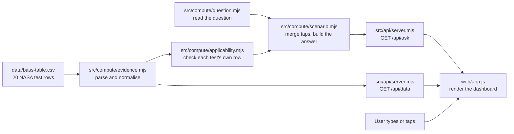

# Will It Burn? — how it works

This file explains how a question becomes an answer. It covers where the data comes from, how the search reads a question, how the answer is built, and how the browser turns the answer into the dashboard. For the idea and the user journey, read [will-it-burn-concept.md](will-it-burn-concept.md).

## Run it

Node.js 22 or newer. No install step and no packages.

```powershell
node src/api/server.mjs
```

The server prints two addresses:

```text
Will It Burn?: http://127.0.0.1:3000/
FlameScope:    http://127.0.0.1:3000/research/
```

Run the tests with `node --test`.

## The big picture



The server decides every scientific statement. The browser only draws what the server sends back. That keeps the logic in one place, where tests can check it.

| File | Job |
|---|---|
| `data/bass-table.csv` | The 20 BASS-II rows, transcribed from NASA/TM-20210011385, Table 5.1, printed p. 57 |
| `data/provenance.json` | Where the rows came from, how they were transcribed, and their known limits |
| `src/compute/evidence.mjs` | Loads the CSV into clean records. It is shared with FlameScope. |
| `src/compute/question.mjs` | Reads the question into conditions. Each one is given, omitted, unresolved or unrecorded. |
| `src/compute/applicability.mjs` | The applicability policy (ADR-012): checks the material, gravity and air for the whole set, then every other condition against each test's own row, all together. Derives each set's bounds from its rows. |
| `src/compute/catalog.mjs` | Missions, other places, cabin airs, materials and the cited sources |
| `src/compute/scenario.mjs` | Merges the question with taps and builds the answer: verdict, evidence, gaps, closest tests and nearest evidence |
| `src/compute/findings.mjs` | Ranks what the 20 rows show by how consistently pairs of readings agree, with pair and distinct-test counts |
| `data/fire-response.json`, `src/compute/response.mjs` | NASA's ISS fire-response steps, quoted in NASA's order, with the evidence for each step |
| `src/acquire/psi.mjs` | Fetches NASA's PSI experimental tables through `safe.mjs`: PSI-25 to cross-check our O₂ values, and PSI-69 (FLEX) |
| `data/bass-fabric.csv`, `bass-nomex.csv`, `bass-extinction.csv`, `src/compute/sets.mjs` | SIBAL fabric (Table 7.1), Nomex (Table A.2) and extinction speeds (Table 2.1), from the same report. `ask()` answers fabric and Nomex from their outcomes: **Mixed** or **No flame held** (ADR-011). |
| `data/psi-99-saffire-2.csv`, `src/compute/saffire.mjs` | NASA's Saffire-II table. One "also seen in another experiment" line per answer (`related`), never part of the verdict. |
| `data/psi-69-flex.csv`, `src/compute/flex.mjs` | NASA's FLEX droplet table, for the suppressant line on the fire-response card |
| `src/compute/csv.mjs` | The CSV reader shared by the loaders and the PSI fetcher |
| `src/api/server.mjs` | The local HTTP server: static files plus the JSON routes |
| `web/index.html`, `style.css`, `app.js` | The Will It Burn? page |
| `web/state.js` | The page's request logic, with no DOM, so Node tests run the same code: the newest intent wins, stale replies are dropped, and an Unclear answer is never a base for taps |
| `test/` | The question, applicability, scenario, frontend, API, MCP and data tests (§11) |

## 1. Where the data comes from

The data is **not fetched from the internet at runtime**. The team transcribed the rows by hand from the NASA report into a CSV that ships with the project. That makes the app work offline and keeps every number traceable to one printed page.

`data/bass-table.csv` has one row per test:

| Column | Meaning | Unit |
|---|---|---|
| `test_id` | NASA's test name, M1 to M20 | none |
| `thickness_mm` | Acrylic sheet thickness | mm |
| `width_cm` | Sheet width | cm |
| `burning_sides` | 1 or 2 sides burning | count |
| `velocity_cm_s` | Airflow readings, separated by `;` | cm/s |
| `spread_mm_s` | Flame spread at each airflow, same order. Blank means not tracked. | mm/s |
| `burn_min` | How long the test burned | minutes |
| `initial_o2_vol_pct`, `final_o2_vol_pct` | Oxygen at the start and end of the test | % by volume |

A synthetic example row, not real data, looks like this:

```text
MX,2,2.2,2,10;6,0.050;0.041,20.0,21.0,19.5
```

That reads as a 2 mm sheet, 22 mm wide, burning on two sides. It spread at 0.050 mm/s at 10 cm/s airflow and 0.041 mm/s at 6 cm/s. It burned for 20 minutes while oxygen fell from 21.0% to 19.5%.

## 2. Loading and cleaning: `src/compute/evidence.mjs`

When the server starts, `evidence.mjs` reads the CSV once and turns each line into a record:

- **Arrays stay paired.** `10;6` and `0.050;0.041` become `velocity: [10, 6]` and `spread: [0.050, 0.041]`. Position 0 of one goes with position 0 of the other.
- **Units are normalised.** Width in cm becomes `widthMm`. Airflow stays cm/s and spread stays mm/s.
- **Missing stays missing.** A blank spread becomes `null`, never zero. M6 and M12 are like this.
- **Fixed facts are attached.** Every record gets its material (PMMA), geometry (sheet), flow direction (opposed) and exact source location.

Both FlameScope and Will It Burn? use these same records.

## 3. What the tests recorded, and how a question is matched

`src/compute/applicability.mjs` derives what the rows record from the records themselves, never from typed-in numbers, so it updates by itself if rows are added. For acrylic:

| Condition | Recorded by the tests | How a question is checked |
|---|---|---|
| Material | Acrylic (PMMA). Every row is PMMA. | For the whole set |
| Gravity | Microgravity on the ISS, where BASS-II ran | For the whole set |
| Cabin air | The station's own air, in a glovebox | For the whole set. A cabin-air preset is shown as "station air" (context), not as a measured oxygen match. |
| Oxygen | Each test's start and end values, 16.8% to 22.2% overall | Per test: an oxygen you give must lie within that test's start-to-end span |
| Pressure | Not recorded in any table | Never a match. BASS-II ran at the station's nominal 14.7 psi (1 atm), so that value is shown as "Not recorded". Any other pressure is a gap. |
| Airflow | Each test's set values, 2 to 21 cm/s overall | Per test: it must be one of that test's settings |
| Thickness | 1, 2, 3, 4 and 5 mm | Per test: exact |
| Width | 12 and 22 mm | Per test: exact |

A test counts only if its own row records **every** condition you gave, all together. The overall ranges are context for headlines, never a match. Nothing is interpolated between recorded values or stretched beyond them, and there is no tolerance (ADR-012).

Acrylic oxygen and airflow are never tied within one test. The table gives oxygen only at the start and end, so it can't say what the oxygen was at a given airflow reading. A question that gives both therefore answers No data, with a note saying why.

Fabric and Nomex have their own rules. A SIBAL flow ramp such as "10 to 5" counts as passed through, with the outcome the report names at the ramp's end, and the test's single oxygen value must match exactly. Nomex airflow is an instrument reading, so it never matches a cm/s question.

## 4. How the search works: `parseQuestion()`

The search box is **not an AI model**. It is a small, rule-based reader in `src/compute/question.mjs`. It is predictable, it runs offline, and every rule is covered by tests. It never answers the question. It only turns the words into structured fields, and each condition ends in one of four states:
- **given**: a value the question states, in normalised units, even one no test covers;
- **omitted**: the default applies, and it is shown as a default;
- **unresolved**: malformed, contradictory, or in a unit the app can't convert. The answer is **Unclear**.
- **unrecorded**: clear, but no table records it, such as temperature, sample length or humidity. It blocks a yes or no answer.

Every rule masks the words it reads, so no two rules read the same number. Step by step:

1. **Normalise.** Lower-case the text, turn `O₂` into `o2`, and collapse spaces.
2. **Airflow first**, so "20 mm/s" can never be read as a 20 mm sheet. mm/s, cm/s, m/s, ft/s, per minute or hour, km/h, mph and knots become cm/s. "Still air", "no ventilation" and "fans off" mean 0 cm/s.
3. **Pressure.** psi, kPa, atm, bar, mbar, hPa, Pa, mmHg and torr become psi. Two different pressures are unresolved.
4. **Humidity** is unrecorded. **Oxygen** is read from `34% oxygen` or `O2 at 30%`, or from a bare `34%` with a notice. Two different oxygen shares, or one outside 0–100%, are unresolved.
5. **Airflow or pressure with no usable unit**, such as "airflow of 5", "a flow of 0.3 cm" or "ventilation at 50%", is unresolved, and masked so no later rule reads it as a thickness or an oxygen share.
6. **Temperature** is unrecorded.
7. **Sizes.** mm, cm, µm and inch become mm, with or without a hyphen ("0.5-inch"). "Wide" makes a width, and "long" a length, which is unrecorded. Two thicknesses mean you are comparing, so every thickness is shown.
8. **Place.** The four missions, Earth ("on Earth", "1 g"), other worlds, a gravity number or fraction ("0.38 g", "1/6 g") and gravity words ("partial gravity", "zero gravity"). A room on Earth ("in my kitchen") counts only if nothing else is named. If several places match, the first one wins and a notice says so. "Mars transit" or "on the way to Mars" beats plain "Mars".
9. **Cabin air.** "Exploration" or "low pressure" select the Exploration preset. "Earth-normal" or "sea level" select Earth-normal.
10. **Numbers nothing else read.**
    - A comparison between results ("3 times faster") gets a notice.
    - Years and mission numbers ("2030", "Artemis 3") are names.
    - Chemical names (O2, CO2, N2, H2O) and JP-8 are fine.
    - Any other number, or a digit glued to letters such as "M7", is unresolved, so the answer is Unclear.
11. **Thin and thick** map to the thinnest and thickest tested sheet, with a notice, but only when no size was given and no number was left unread.
12. **Material.** If the subject of the question names something the catalog doesn't list, such as "steel", it stays that material and answers No data. Otherwise the first tested material wins, and a notice says the others aren't shown. Otherwise the first untested one is used.
13. **Safety words.** "Safe", "certify" and "recommend" add a notice that the tool can't certify materials.
14. **Say when nothing was found.** If no field matched, a notice says the defaults are shown.

Examples, taken from the tests:

| Question | Fields found |
|---|---|
| Will acrylic burn on the ISS? | mission `iss`, material `pmma` |
| Will it burn on a Moon base at 34% oxygen? | mission `moon`, oxygen `34` |
| What about Mars transit in exploration air? | mission `transit`, air `exploration` |
| Does a 1 mm sheet burn faster than 5 mm? | thickness `all`, with a "comparing" notice |
| Will a 1 mm acrylic sheet burn in still air? | thickness `1`, airflow `0`, material `pmma` |
| Is Nomex safe on a Mars base? | mission `mars`, material `nomex`, with a safety notice |
| plexiglass at 56.5 kPa | material `pmma`, pressure `8.2` psi |
| Will acrylic burn on the ISS with 20 mm/s airflow? | airflow `2`, never a 20 mm sheet |
| Will steel burn on the ISS? | material `other` ("steel"), answers No data |
| Will acrylic burn on the ISS at 0% oxygen? | oxygen `0`, answers No data |
| acrylic at 21% and 34% oxygen | unresolved oxygen, answers Unclear |
| Will a 0.5 in acrylic sheet burn on the ISS? | unresolved number ("0.5 in"), answers Unclear |
| Will acrylic burn at 25 °C? | unrecorded temperature, answers No data |

### Why not use an AI model for this?

A fire-safety tool must not guess. Rules are easy to test and never invent a field. If the team wants AI later, the safe way is the same pattern FlameScope already uses: the model may only fill the same fields, validated against this schema, and the app falls back to the rules if the model fails. The model would never write the answer.

## 5. Merging the question with taps: `resolveScenario()`

Each field is filled in this order:

1. **A tap**, meaning an explicit URL parameter such as `mission=moon`.
2. **The question**, meaning what `parseQuestion()` found.
3. **A default:**
   - Mission defaults to ISS.
   - Air defaults to that mission's usual air.
   - Material defaults to acrylic.
   - Thickness defaults to all sheets.
   - Airflow defaults to any tested airflow.

The server records where each field came from: `picked`, `question` or `default`, plus `unresolved` for a condition it couldn't read. The page shows that as the chip colours in the **Read as** row. An explicit value is never swapped for a default: 0% oxygen stays 0%, and a place or material outside the data stays what was asked.

An unresolved condition stays unresolved unless a tap replaces it. A cabin-air tap replaces an unreadable oxygen share or pressure, a thickness tap an unreadable thickness, and a mission tap an unreadable gravity. A number the reader couldn't place has no tap, so the question has to be reworded. The Unclear subline names only the taps that would help.

Cabin air works like this:

- Start from a preset: Earth-normal is 14.7 psi at 21%, and Exploration is 8.2 psi at 34%.
- Apply any oxygen or pressure number on top of the preset.
- If the result matches a preset exactly, it takes that preset's name. Otherwise it is called "Custom."
- The server always calculates oxygen partial pressure in kPa as well.

Bad input is refused rather than guessed. Examples are an unknown mission, a non-number thickness, a boolean where a number goes, a value out of range, or a question longer than 500 characters. The server returns HTTP 400 with a plain message.

## 6. Checking the cabin against the evidence

`applicability()` in `src/compute/applicability.mjs` builds one row per condition. Each row has a status:

| Check | Status when it holds | Status when it fails | Shown |
|---|---|---|---|
| Material | `match`: the material has an evidence set | `mismatch` | Always |
| Gravity | `match`: microgravity | `mismatch` | Always |
| Oxygen | `context` for the station's own air given as a preset ("station air"). `match` when an oxygen share you gave lies in at least one test's recorded span. | `mismatch`, including a preset such as Exploration air | Always |
| Pressure | `unrecorded` at 14.7 psi: consistent, but not in any table | `mismatch` | Always |
| Airflow, thickness, width | `match` when at least one test recorded that value | `mismatch` | When you gave one |
| Temperature, length, humidity | none | `unrecorded`, which blocks a yes or no | When you gave one |
| Together | none | `separately`: each condition is recorded somewhere, but no single test has them all | When you gave more than one |

The answer is Burned, Mixed or No flame held only if every set-level check holds and at least one test's own row passes every per-test check. That test's ID goes in `applicability.matched`. Otherwise the answer is **No data**. When some tests record some of your conditions, `closest` lists them, with each recorded value and each miss. A test that records some of your conditions but not all is never counted as a match.

## 7. Building the answer: `ask()`

`ask()` is the single function behind `GET /api/ask`. It returns everything the page needs.

**When at least one test matches:**

- **Verdict:** a "Burned" stamp, a count such as "4 of 4 matching tests", and the burn-time range for the matching rows. Fabric answers Mixed and Nomex answers No flame held, from their outcomes.
- **Evidence** (matching tests only):
  - The matching test IDs.
  - A count of tests and of tests with spread not tracked.
  - The shortest and longest burn.
  - The fastest and slowest spread, each with its test ID, thickness and airflow. These are `null` when no matching test tracked its spread.
- **Finding:** with all thicknesses, it compares the fastest 1 mm sheet with the fastest 5 mm sheet. With one thickness, it gives that thickness's spread range and airflow range.
- **Why it matters:** a sourced line from the related BASS-II rod study.
- **Ranked findings:** five descriptive findings over all 20 tests, from `findings.mjs`. See below.

### Ranked findings: `findings.mjs`

The challenge asks the dashboard to rank findings. `rankFindings()` does this with fixed, checkable rules. It computes the result once, when the server starts:

1. **Reading pairs.** For each factor (airflow, thickness, width, oxygen, burning sides), pair every two measured spreads that match on the listed conditions. Each finding says what is matched (`matchedOn`) and what isn't (`notMatched`).
   - Airflow pairs come from inside one test, where the sample stays the same, but the oxygen at each reading isn't known.
   - The others pair different tests at the same airflow. Their oxygen differs, and the text says so ("but not the same oxygen").
   - Untracked spreads (M6, M12) never enter a pair.
2. **Agreement.** A pair agrees when the side the lead expects to be faster really spread faster. For example, the thinner sheet in a thickness pair.
3. **Counts.** Pairs reuse readings, so they aren't independent results. Each finding shows its pair count beside the number of distinct tests, and names the test that appears in the most pairs (`busiest`).
4. **Tier.** This is the app's display rule, not a statistical test:
   - Consistent: 10 or more reading pairs, with at least 85% agreeing.
   - Suggestive: 4 or more, with at least 75%.
   - Mixed: 4 or more, under 75%.
   - Too few pairs: under 4.

   Only Consistent and Suggestive findings get a claim as their lead. The others show just the topic.
5. **Order.** Sort by tier, then by the share that agrees, then by the number of pairs.
6. **Caveats from the rows.** Oxygen fell during every test, and the table gives only start and end oxygen, so airflow can't be separated from it. The one airflow exception, M3, is also the only test listed from low to high flow. All 3 thickness exceptions had more starting oxygen on the thicker sheet.

Today's result:

| Finding | Agreeing pairs | Distinct tests | Tier |
|---|---|---|---|
| Airflow | 29 of 30 | 13 | Consistent |
| Thickness | 23 of 26 | 16 | Consistent |
| Width | 3 of 4 | 6 | Suggestive |
| Oxygen | 2 of 2 | 4 | Too few pairs |
| Burning sides | 0 of 1 | 2 | Too few pairs |

Every pair is returned in `pairs`, so each count can be checked row by row.

**When no test matches:**

- **Headline:** built from the first failing check, in this order: material, gravity, oxygen, pressure, airflow, thickness, width, an unrecorded condition, then "together". For example: "Unknown. No single test had all of these conditions."
- **Gap cards:** each failing check adds one or two cards, and every card carries its source link.
  - **Gravity:** two cards. One cites LUCI, the first lunar-gravity burns longer than 25 seconds (NTRS 20250010653). The other cites the Fire Safety Journal rod study, which puts lunar gravity near the worst case for acrylic rods.
  - **Oxygen and pressure:** one card compares oxygen partial pressure with the tested range. When that pressure is inside the range, it adds that the cabin has less than half the nitrogen. Saffire V and VI are named as where the data lives: about 10 psi and 26% O₂, and about 8 psi and 29–31% O₂ (ICES-2024-365, Table 1). SoFIE is named too.
  - **Airflow:** still air, flows outside the tested range, or a value between two set values, naming the nearest settings and their tests.
  - **Thickness and width:** the tested sizes.
  - **Together:** when each condition is recorded somewhere but no single test has them all.
- **Closest tests:** tests that record some of your conditions, each with its recorded values and misses. They are never counted as matches.
- **Nearest evidence:** a set of parameters that reaches matching tests.
  - It first fixes the set-level checks: acrylic (or SIBAL for cotton and fabric), the ISS with Earth-normal air, or Earth-normal air alone.
  - Then it relaxes the smallest set of per-test conditions that lands on a match: any tested airflow, any width, station air, or the nearest tested thickness.
  - It says what it switches to and what it leaves out.
  - The tests check that it lands on Burned, Mixed or No flame held for each kind of gap they cover (11 questions, from the audit cases to Earth, steel and an unrecorded temperature). That is not a proof for every possible question.
- **Unclear:** when a condition couldn't be read, there is no evidence, no gap card and no nearest button. `unresolved` gives the reason for each unreadable condition, and `canonical` is the question exactly as asked.

**In both cases the response also includes:**

- **A canonical question**, such as "Will a 1 mm acrylic sheet burn on the ISS in Earth-normal air?". The page writes it into the search box after a tap, so the box always matches the screen.
- **The Read-as chips and notices.**
- **One badge per mission tile**, counting how many tests match that mission with its own default air.

## 8. The API

### `GET /api/ask`

Every parameter is optional.

| Parameter | Values | Meaning |
|---|---|---|
| `q` | Up to 500 characters | The typed question |
| `mission` | `iss`, `moon`, `transit`, `mars`, `earth`, `other` | A tapped mission, Earth, or another place |
| `place`, `g` | Text; 0 to 10 | With `mission=other`: the place's name and its gravity in g |
| `air` | `earth`, `exploration` | A tapped cabin-air preset |
| `o2` | 0 to 100 | An explicit oxygen share in % |
| `psi` | 0 to 1000 | An explicit cabin pressure in psi |
| `material` | `pmma`, `sibal`, `nomex`, `cotton`, `other` and others | A material id |
| `materialName` | Text | With `material=other`: the material's name, reduced to plain words |
| `thickness` | `all`, or 0.001 to 1000 | Sheet thickness in mm |
| `width` | `all`, or 0.1 to 10000 | Sample width in mm |
| `airflow` | `none`, or 0 to 100000 | Airflow in cm/s |

A value outside these ranges, or of the wrong type (a boolean where a number goes), is refused with HTTP 400. A value inside them that no test covers, such as 0% oxygen or 100 psi, is kept and answers No data.

A trimmed real response for `q=Will a 1 mm acrylic sheet burn on the ISS?`:

```json
{
  "canonical": "Will a 1 mm acrylic sheet burn on the ISS in Earth-normal air?",
  "notices": [],
  "understood": [{ "field": "Mission", "value": "ISS", "from": "question" }],
  "scenario": { "mission": { "id": "iss" }, "air": { "key": "earth", "psi": 14.7, "o2": 21, "po2": 21.3 }, "thickness": 1, "width": null, "airflow": null },
  "missions": [{ "id": "iss", "matches": 4, "selected": true }, { "id": "moon", "matches": 0, "selected": false }],
  "checks": [{ "key": "gravity", "label": "Gravity", "yours": "µg", "tested": "µg (ISS)", "status": "match", "statusLabel": "Match", "ok": true, "note": null }],
  "applicability": { "policy": "A test counts only if its own row records every condition you gave, all together. …", "matched": ["M1", "M6", "M7", "M16"], "given": ["thickness"] },
  "verdict": { "state": "burned", "stamp": "Burned", "count": "4 of 4 matching tests",
               "sub": "All 4 of the 1 mm sheets in the BASS-II tests burned in orbit, for 6 to 18 minutes each." },
  "evidence": {
    "ids": ["M1", "M6", "M7", "M16"],
    "stats": { "tests": 4, "notTracked": 1, "burnMin": 6.4, "burnMax": 18.4,
               "fastest": { "id": "M16", "thicknessMm": 1, "velocity": 5, "spread": 0.144 },
               "slowest": { "id": "M7", "thicknessMm": 1, "velocity": 3, "spread": 0.07 } },
    "finding": { "lead": "1 mm sheets", "text": "spread at 0.07–0.144 mm/s across 2–10 cm/s of airflow." }
  },
  "findings": {
    "tests": 20,
    "rule": "This is the app’s display rule, not a statistical test. Consistent: 10 or more reading pairs, at least 85% agreeing. …",
    "ranked": [{ "rank": 1, "key": "airflow", "tier": "consistent", "tierLabel": "Consistent", "agree": 29, "comparisons": 30, "tests": 13,
                 "lead": "More airflow, faster spread.",
                 "text": "Inside single tests, the faster airflow had the faster spread in 29 of 30 reading pairs, from 13 tests.",
                 "matchedOn": ["the same test"], "notMatched": ["oxygen at each reading"], "busiest": { "id": "M7", "pairs": 6 },
                 "exceptions": ["M3"], "ids": ["M2", "M3", "…"], "pairs": ["…"] }]
  },
  "closest": null,
  "gaps": [],
  "nearest": null
}
```

`findings` is the same for every acrylic answer with matching tests, because it ranks all 20 acrylic tests. It is `null` otherwise, including for fabric and Nomex, so the page never shows these findings next to a cabin or material the tests don't cover.

For a gap, such as `q=Mars transit in exploration air`, `evidence` and `findings` are `null`, and `gaps` and `nearest` are filled in:

```json
{
  "verdict": { "state": "no-data", "headline": "Unknown. These tests stopped at 22.2% oxygen." },
  "gaps": [{ "topic": "Oxygen & pressure",
             "text": "Your cabin’s oxygen partial pressure, 19.2 kPa, sits inside the tested 17–22.5 kPa. But it has less than half the nitrogen…",
             "source": { "name": "NASA evidence report (2015): the 8.2 psia, 34% O₂ exploration atmosphere", "url": "https://ntrs.nasa.gov/citations/20150021491" } }],
  "nearest": { "label": "Show the nearest evidence we have", "changes": "Switches to Earth-normal air.", "params": { "air": "earth" } }
}
```

When each condition is recorded somewhere but no single test has them all, as in `q=Will a 1 mm acrylic sheet burn on the ISS at 16.8% oxygen and 21 cm/s?`, a `together` check fails and `closest` lists the tests that come nearest:

```json
{
  "verdict": { "state": "no-data", "headline": "Unknown. No single test had all of these conditions." },
  "checks": [{ "key": "together", "status": "mismatch", "statusLabel": "Not in one test", "note": "No single test recorded all of these." }],
  "closest": { "tests": [{ "id": "M1", "sourceLocation": "Table 5.1, printed p. 57, row M1", "conditions": [
    { "key": "oxygen", "ok": false, "recorded": "22.2% → 21.9%" },
    { "key": "airflow", "ok": false, "recorded": "9 cm/s" },
    { "key": "thickness", "ok": true, "recorded": "1 mm" }] }] },
  "nearest": { "changes": "Switches to Earth-normal air and any tested airflow.", "params": { "air": "earth", "airflow": "none" } }
}
```

When part of the question can't be read, as in `q=Will a 1 mm acrylic sheet burn at 150% oxygen?`, nothing is answered:

```json
{
  "canonical": "Will a 1 mm acrylic sheet burn at 150% oxygen?",
  "verdict": { "state": "unresolved", "stamp": "Unclear", "count": "Not answered",
               "headline": "Unclear. An oxygen share has to be between 0% and 100%.",
               "sub": "This app won’t guess a value you didn’t give. Reword the question, or tap the cabin air to replace it." },
  "unresolved": [{ "key": "o2", "label": "Oxygen", "reason": "An oxygen share has to be between 0% and 100%." }],
  "evidence": null, "closest": null, "gaps": [], "nearest": null
}
```

Errors come back as HTTP 400 with `{ "error": "Unknown mission. Use iss, moon, transit or mars." }`.

### `GET /api/data`

This returns all 20 records, the provenance, `fireResponse` and `findings`. The page loads it once. It uses them to draw every point on the chart, fill the proof table, and draw the fire-response and ranked-findings sections. `findings` is the same ranking that `ask()` returns for covered cabins. It is served here too, so the Ranked findings section works whatever the current answer is.

`fireResponse` holds NASA's eight ISS fire-response steps from OCHMO-TB-008 Rev A (29 Nov 2023). Each step is quoted in NASA's order and comes with its evidence lines, their sources and an evidence status. Two lines are computed, so they can't drift from the data. Under step 2 is the airflow finding and the lowest tested airflow, from the BASS-II rows. Under step 5 is FLEX's count of CO₂ and helium tests, from NASA's own table (`data/psi-69-flex.csv`). The section looks the same for every answer: the page never links a verdict to a step (ADR-010).

## 9. From JSON to the dashboard: `web/app.js`

**Boot**

1. Show the section named in the URL hash, or the Overview.
2. Load `/api/data` once. Keep the 20 records, and draw the fire-response and ranked-findings sections.
3. Put the first suggested question in the box and call `/api/ask`.

**Sections**

The page is laid out like a Mac app window: a toolbar with the Ask field, a sidebar with four sections (Overview, Ranked findings, Fire response and Sources), and the content. On phones the sidebar becomes a bottom tab bar. The sections are links to `#overview`, `#findings`, `#response` and `#sources`. `showTab()` shows the one in the hash, marks its link with `aria-current` and moves focus to its heading, so links and the Back button work. Asking a question from another section switches back to the Overview.

**Input**

- **Submitting the form** sends only `q`.
- **Tapping a suggested question** fills the box and sends `q`.
- **Tapping a keyword** adds it to the box without sending anything. The keywords open under the Ask field while it has focus.
- **Tapping a tile, the air switch, a material, a thickness chip or "nearest evidence"** calls `change(patch)` in `web/state.js`. A material tap also resets the thickness to all.
  - The tap builds on the newest *intended* scenario, not on the last reply, so two quick taps both count.
  - The base is the answered scenario as explicit parameters (`paramsFrom`), with the tapped field overridden.
  - A new mission drops the air fields, so that mission's default air applies.
  - After an **Unclear** answer, the tap sends the question again with the tapped field (`baseFrom`). The answer stays Unclear unless the tap replaces the part that couldn't be read. Nothing read from an unclear question ever travels as a tapped value.
  - A tap made while a typed question is still being read waits for that answer, then applies to it.
  - The reply's canonical question replaces the text in the box. For an Unclear reply, that is the question as asked.

**Stale replies and neutral states**

- Every request gets a version number. If an older reply arrives after a newer one, it is ignored, so fast tapping can never show the wrong answer.
- The page opens on a neutral "Loading…" stamp, not a verdict.
- A failed request shows "Not answered", clears the answer panels, and says which question it was.
- While an answer is on screen, "Asked: “…”" shows the question it answers.

**Where each response field is drawn**

| Response field | Where it appears |
|---|---|
| `understood`, `notices` | The Read-as chips and the notices above the verdict |
| `missions` | The four mission tiles and their match badges |
| `verdict`, `why` | The verdict word and test count, the headline, the subline and the "why it matters" line |
| `scenario.air` | The cabin-air switch, the chamber readouts and the partial pressure |
| `scenario.material` | The checkmark in the Cabin card's material picker |
| `checks` | The Evidence match card: one pill per condition with its status label (Match, Station air, Not recorded, In other tests or Gap, and "Not in one test" for the together row), plus its note |
| `unresolved` | The "What couldn't be read" cards, in place of the evidence |
| `closest` | The closest-tests table under the gap cards, each recorded value and each miss |
| `scenario.mission.g`, `verdict.state`, `evidence` | The chamber flame: solid only for matched evidence in microgravity, the unlit sample for No flame held, and a dashed outline otherwise |
| `evidence` | The key-number cards (`renderKpis`: four numbers for acrylic, or the test count and an outcome bar for fabric and Nomex), and the evidence card with the thickness chips, chart, finding and caveat, or the report's rows |
| `findings` (from `/api/data`) | The Ranked findings section and its Overview card. Each row has its tier, "Agrees in N of M comparisons", one dot per comparison, and a button that opens its rows. |
| `fireResponse` (from `/api/data`) | The Fire response section, and the Overview card with one line per step and its status |
| `gaps`, `nearest` | The evidence card when there is a gap: the cards and the nearest-evidence button |
| `evidence.ids`, `sources` | The proof sheet: the source rows or the source list |

**The look**

The page follows Apple's design language. It uses Apple's system colours for light and dark mode, and grouped cards on a grey background. Its controls are segmented controls, inset lists, capsule chips and a translucent toolbar. The type is the system font: San Francisco on Apple devices, Segoe UI on Windows. Nothing is downloaded, so the page still works offline. The verdict colours are orange for Burned and Mixed, grey for No flame held and amber for No data. None is ever green, so a verdict can't read as "safe".

**The chart**

- It is plain SVG built in code, with no chart library.
- The x axis runs from 0 to 22 cm/s of airflow, and the y axis from 0 to 0.16 mm/s of spread.
- Every tracked test is drawn. Readings from one test are joined by a line.
- Tests in the current answer are coloured by thickness. Everything else is grey.
- The colour ramp passed a colour-blind safety check in both light and dark themes.
- Hovering a dot shows its values. Clicking a dot, or pressing Enter on it, opens that test's row.
- If you gave an airflow, a dashed line marks it.

**The flame**

The flame is a canvas animation. It is drawn from simple shapes and is always labelled "Illustration":

- For matched evidence in orbit it is a blue sphere, with a small Earth teardrop for comparison.
- For No flame held, only the unlit sample is drawn.
- For every other answer, including No data in orbit, an Unclear question and a failed request, it is a dashed outline with a question mark.
- It pauses when scrolled off screen, and stays still if the user prefers reduced motion.

## 10. Security and offline use

- The server listens on 127.0.0.1 only. It answers only requests whose Host header is one of its own loopback names, which guards against DNS rebinding. Cross-origin POSTs are refused, and the brief's JSON body is type-checked.
- The page loads no remote fonts, scripts or libraries. The content security policy allows only the server itself, so there are no inline scripts or inline styles.
- Every piece of text from the server is escaped before it is put on the page.
- Will It Burn? sends nothing to any outside service. Its evidence is committed data in `data/`.
- The web server's only outside call is the research view's optional AI brief. It goes through `src/agents/provider.mjs`, which refuses with `OFFLINE=1` or without a key and never caches (ADR-013).
- Outside the web server, the MCP tool `get_provenance` fetches the NTRS citation through `safe.mjs`, which falls back to the committed fixture offline.

## 11. Tests

Run `node --test` (with `OFFLINE=1`, and with any OpenAI key unset: `env -u OPENAI_API_KEY`). No test calls a real model.

`test/applicability.test.mjs` checks the matching policy (ADR-012):

- The two audit cases that used to answer Burned (1 mm at 16.8% O₂ and 21 cm/s; SIBAL at 21% O₂ and 53 cm/s) now answer No data, with the closest tests.
- Supported combinations still answer, and acrylic oxygen and airflow are never tied within one test.
- Airflow between two set values, and pressure, follow the policy. SIBAL's flow ramps count their end outcome.
- The nearest-evidence button reaches matching tests for each kind of gap tested, through the page's own request logic.

`test/question.test.mjs` checks the reader:

- Units are normalised, and a velocity is never read as a thickness.
- Explicit values, places and materials outside the data are kept, never replaced by a default.
- Malformed, contradictory or unreadable conditions, and numbers the reader can't place, answer Unclear.
- An airflow or pressure it can't convert never comes back as a thickness or an oxygen share.
- Unrecorded conditions block an affirmative answer, and a safety question never gets a yes or no.

`test/frontend-home.test.mjs` runs `web/state.js` against real answers: fast taps keep the newest intent, stale replies are dropped, a tap after Unclear re-sends the question, and only matched evidence gets a confident flame.

The Will It Burn? tests in `test/scenario.test.mjs` check that:

- The acrylic bounds are derived from the rows.
- Each suggested question is read the way the concept doc promises.
- Units, synonyms and ambiguous questions are handled as documented.
- Taps beat the question, and the question beats defaults.
- The evidence numbers match the table rows exactly.
- Every gap card has a source, and the nearest-evidence parameters really reach evidence.
- Bad input is refused.
- The routes serve the page, redirect the old `/burn` address to `/`, and answer `/api/ask`.
- The cited claims on the gap cards and the "why it matters" line match the sources checked on 2026-09-24.

`test/api-security.test.mjs` checks the Host and Origin allowlists, the brief body's types, and the AI path with a mocked provider (errors, timeouts, malformed replies, offline refusal). `test/mcp.test.mjs` spawns the real MCP server and checks bad lines, schema checks and protocol negotiation. `test/acquire.test.mjs` checks that a corrupt cache file falls back to the fixture.

`test/findings.test.mjs` checks the ranked findings:

- The order, tiers and counts follow the documented rule, and each finding reports its distinct tests and says that pairs reuse readings.
- Every compared pair is two real table readings.
- The caveats are computed from the rows.
- Untracked spreads never count.
- The wording stays descriptive.
- `ask()` returns the ranking only for covered cabins, and `/api/data` serves it for every answer.

`test/response.test.mjs` checks the fire-response section:

- NASA's eight steps are quoted word for word, in order, with the source and date.
- Every evidence line has a source.
- The BASS-II line is computed from the rows.
- The app's own wording has no orders or safety words.
- `/api/data` serves the section.

`test/sets.test.mjs` checks the fabric, Nomex and extinction tables:

- Table 7.1 has the report's counts: 6 quenched, 3 didn't ignite, 1 blow-off, 8 reused.
- Published rows reproduce exactly.
- The Nomex O₂ values match NASA's PSI-25 table.
- SIBAL gets Mixed (20 of 23), and Nomex gets No flame held, which never reads as a safety rating.
- Cotton points to SIBAL, and still air shows Table 2.1.

`test/saffire.test.mjs` checks the Saffire-II table:

- It has 9 samples, and blank materials fill from the row above.
- Published cells and notes reproduce exactly.
- Silicone didn't spread in orbit in 4 of 4, while 3 of 4 burned on the ground.
- The line appears beside answers, never as the verdict.

`test/flex.test.mjs` checks NASA's FLEX table:

- It has 274 tests: 123 with CO₂ and 50 with helium.
- Two published rows reproduce exactly.
- Each row's gas fractions add up to about 1.
- The en dash for "no value" stays missing.

`test/psi.test.mjs` checks the cross-check against NASA's PSI-25 table:

- All 40 transcribed O₂ values match NASA's file.
- Blank cells stay `null`.
- The table loads offline from the committed fixture.

## 12. Extending it

- **Add a mission.** Add an entry to `MISSIONS` in `src/compute/catalog.mjs` with its gravity, default air and wording, plus a word pattern in `PATTERNS.mission` in `src/compute/question.mjs`.
- **Add a material with real data.** Add its rows to the data layer with their own source, mark it `supported` in `catalog.mjs`, and give it an evidence set in `applicability.mjs` (`SETS`, and its per-test rules in `PER_TEST`) that says how each condition is recorded for it.
- **Add reduced-pressure, raised-oxygen data.** Transcribing the Saffire IV–VI results would give real evidence for cabins near 8–10 psi and 26–31% oxygen. Keep it a separate set, because its flow ran with the flame, not against it. A 34% oxygen cabin would still need SoFIE results or new tests. See [planning/datasets.md](planning/datasets.md).
- **Add an AI reader.** Let a model fill only the parser's fields, validate them, and fall back to the rules. See the section on why the reader isn't AI.

## 13. Known limits

- One NASA report and one investigation. The 20 acrylic rows are not 20 independent studies.
- Pressure is not in any table. Only the station's 14.7 psi is consistent with how BASS-II ran, and it is shown as "Not recorded", never as a match.
- Oxygen values are the start and end of each test, not a constant level. So acrylic oxygen and airflow can never be matched together.
- Matching is exact, with no tolerance. An airflow between two set values, or an oxygen share just outside a test's span, answers No data. Any tolerance would need its own ADR and a stated measurement basis.
- The reader recognises the listed words and patterns. A number or unit it can't read makes the answer Unclear. A place or material named in words it doesn't know (for example "Soyuz") can still fall back to the default, shown as a dashed chip.
- Findings describe the data. The tiers are the app's display rule, not a statistical test, and they are not causal claims or safety ratings.
